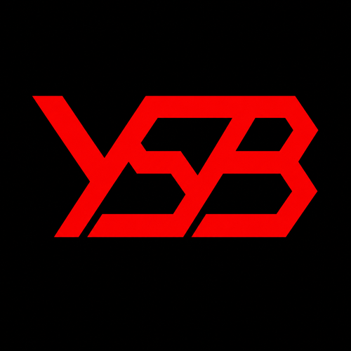
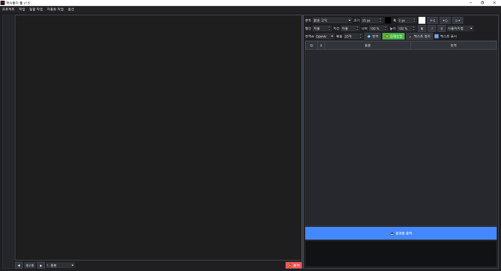

<p align="center">
  
</p>

# 역식붕이 툴 / YSB Translator Tool

이미지 번역, OCR, 마스킹, 인페인팅, 식질을 한 흐름으로 처리하는 반자동 역식 워크스테이션입니다.

<p align="center">
  
</p>

## v2.1.0 Lite / Local split

v2.1.0부터 Lite / Local 분리 개발을 위한 기본 구조를 준비합니다.

```text
Lite
- 기존 API 기반 경량판
- onefile 빌드 대상

Local
- Local판: comic_text_detector + PaddleOCR + LOCAL LaMa 중심 구성
- onedir / 폴더형 빌드 대상
```

## 실행 방법 / Run from source

프로젝트 루트에서 원하는 판의 BAT를 실행합니다.

```text
run_lite_v2.1.0.bat
run_local_v2.1.0.bat
```

두 BAT 모두 프로젝트 루트의 `.venv`를 만들거나 기존 `.venv`를 재사용합니다.
`main.py`는 직접 Python으로 실행할 때를 위한 호환용 기본 Lite 진입점이며, 별도 실행 BAT는 제공하지 않습니다.

```text
YSBTranslator/
- main.py
- main_lite.py
- main_local.py
- run_lite_v2.1.0.bat
- run_local_v2.1.0.bat
- requirements/
  - common.txt
  - lite.txt
  - local.txt
  - build.txt
- ysb/
- .venv/                  # 자동 생성
```

## 빌드 방법 / Build

분리 배포판 빌드는 아래 스크립트를 사용합니다.

```bat
build_tools\build_exe.bat
```

이 스크립트는 하나의 공유 `.venv`를 사용하고, Lite와 Local 패키지를 함께 생성합니다.

```text
dist/
- 역식붕이 툴 Lite v2.1.0.exe
- 역식붕이 툴 Local v2.1.0/
- YSB_Launcher.exe
- packages/
  - YSB_Tool_Lite_v2.1.0.zip
  - YSB_Tool_Local_v2.1.0.zip
```

## 폴더 구조 / Source layout

```text
YSBTranslator/
- main.py                  # 호환용 기본 Lite 진입점
- main_lite.py             # Lite 명시 진입점
- main_local.py            # Local 명시 진입점
- ysb_launcher.py
- run_lite_v2.1.0.bat
- run_local_v2.1.0.bat
- requirements/
- assets/
- build_tools/
- local_models/
- ysb/
  - core/                  # 공통
  - engine/                # 공통
  - engines/               # 공통 엔진 인터페이스/래퍼
  - editions/              # Lite / Local 분기 설정
  - i18n/                  # 공통 KO/EN 문구
  - services/              # 공통 작업 로직
  - settings/              # 공통 설정
  - ui/                    # 공통 UI
  - utils/                 # 공통 유틸
```

## requirements 구조

기존 단일 `requirements_ysik_tool.txt`는 v2.1.0 구조에서 제거되었습니다.
의존성은 아래처럼 역할별로 분리합니다.

```text
requirements/common.txt    # Lite / Local 공통
requirements/lite.txt      # API 기반 Lite용
requirements/local.txt     # Local 전용 로컬 엔진용
requirements/build.txt     # 빌드 도구용
```

## 자세한 분리 정책

자세한 내용은 `YSB_V2.1.0_LITE_LOCAL_SPLIT_README.md`를 참고합니다.

## License

This project is licensed under the GNU General Public License v3.0.  
See the [LICENSE](./LICENSE) file for details.

Because this application uses PyQt6, the open-source distribution of this project is provided under the GPLv3 license.

## Copyright and Branding

© 2026 amule949. All rights reserved.

YSB Translator Tool, 역식붕이 툴, and ZeroStress8 are project names and marks used by amule949.

The GPLv3 license applies to the source code in this repository. It does not grant permission to use the project names, logos, icons, branding materials, or other identity elements in a way that implies official endorsement, authorship, sponsorship, or affiliation.

For more details, see [TRADEMARKS.md](./TRADEMARKS.md).


## v2.1.0 Local OCR 구성

- `comic_text_detector`는 OCR이 아니라 텍스트 위치/마스크 감지 계층입니다.
- Local판에서만 사용하며 Lite판에는 포함하지 않는 것을 원칙으로 합니다.
- vendored runtime은 `third_party/comic_text_detector/`에 있습니다.
- Local 빌드에는 `comic_text_detector.pt` 모델이 함께 포함됩니다.
- PaddleOCR은 Local OCR 문자 인식 엔진으로 사용합니다. comic_text_detector가 영역/마스크를 만들고, PaddleOCR이 각 영역의 원문을 읽습니다.
